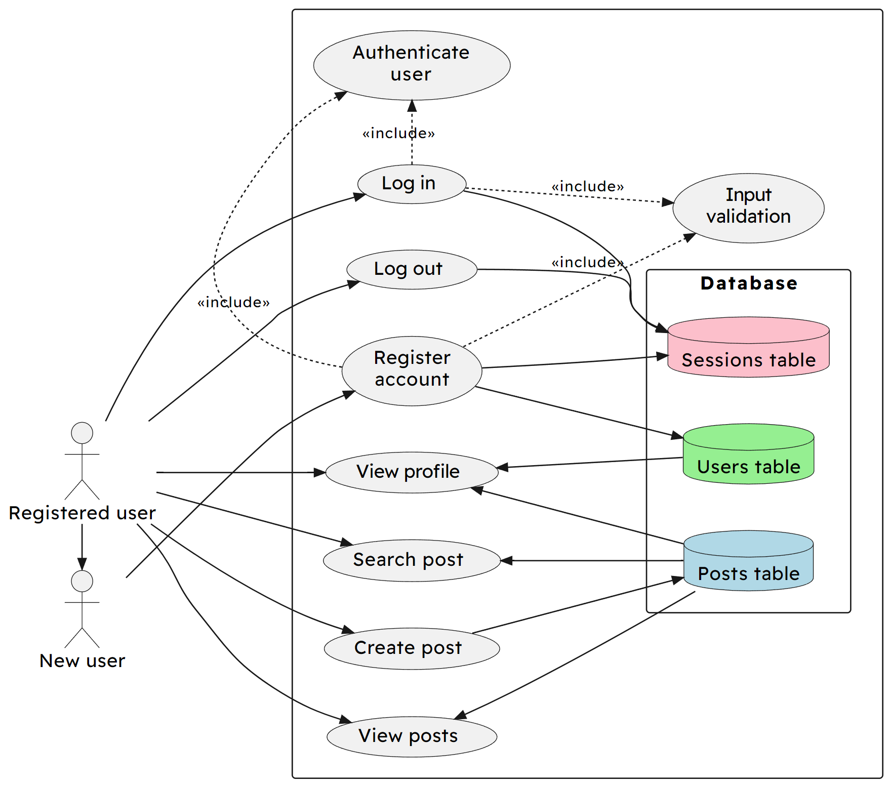

# Analysis of the problem

## Description of the problem

Project idea: A basic microblogging platform. The end users of the application will be other students in the Computing Science class or club, to allow them to share thoughts and ideas, and post updates to projects they're working on.

The platform will be a website with a frontend written in HTML and CSS for their compatibility with nearly all devices, and a backend written in Luau, as it's the language I'm most familiar with, alongside the Lune runtime (analagous to Luvit for Lua, or Node.js/Deno/Bun for Javascript). It will interface with a MySQL database to store user data, sessions, and posts.

The platform will relate to the Software Design and Development area of the course, as it uses the three specified algorithms: bubble sort, insertion sort, and binary search. It could also integrate with the Database Design and Development area of the course, as it uses an SQL database with three tables and opens a connection to send queries to it, as well as the Web Design and Development area of the course, as it uses a web user interface to d isplay the data.

### Scope

The scope of the project will include:

-   A full design of the site, including database schema, user interface wireframes, UML diagrams, query designs, and pseudocode for all used algorithms.
-   A full implementation of the site, including database, backend, and frontend.
-   A completed test plan, including unit tests, personas, test cases, and expected results.
-   Evaluation of the project, including a discussion of the project's strengths and weaknesses, and a reflection on the development process.

### Boundaries

The full implementation of the site will include:

-   A registration system, allowing users to create an account by providing a username and password, and storing this information in a database
-   A login system, allowing users to log in to their account by providing their username and password, and checking this information against the database
-   A session system, allowing users to remain logged in for a period of time, and to log out of their account by deleting their session from the database
-   A post system, allowing users to create posts, view all posts, view posts by a specific user, and search for posts by keyword by using binary search
-   Validation of all user input, to prevent attacks such as cross-site scripting
-   Ability to sort posts by date, using bubble sort and insertion sort

### Constraints

Time: Since beginning the project on 23 November 2023, I have 4 months to complete the project before it should be submitted by 27 March 2024.  
Cost: The project will have no development cost, as it will be using entirely free and open-source software.

## UML use case diagram

## Requirements specification

The project's purpose is for users to be able to make and view posts on a microblogging platform after registering and logging in.

### Functional requirements

-   The system shall store user data, sessions, and posts in a database
-   The site will use a navigation bar to allow users to easily navigate between home, profile, search, and logout pages
-   All user input will be validated to prevent attacks such as cross-site scripting
-   When registering an account, the system will store the user's username and password in the database
-   When logging in, the system will check the user's username and password against the database, and create a session if the details are correct

### End-user requirements

-   A search function for finding posts by a keyword
-   A homepage for viewing all posts by all users in reverse chronological order

## Project plan
