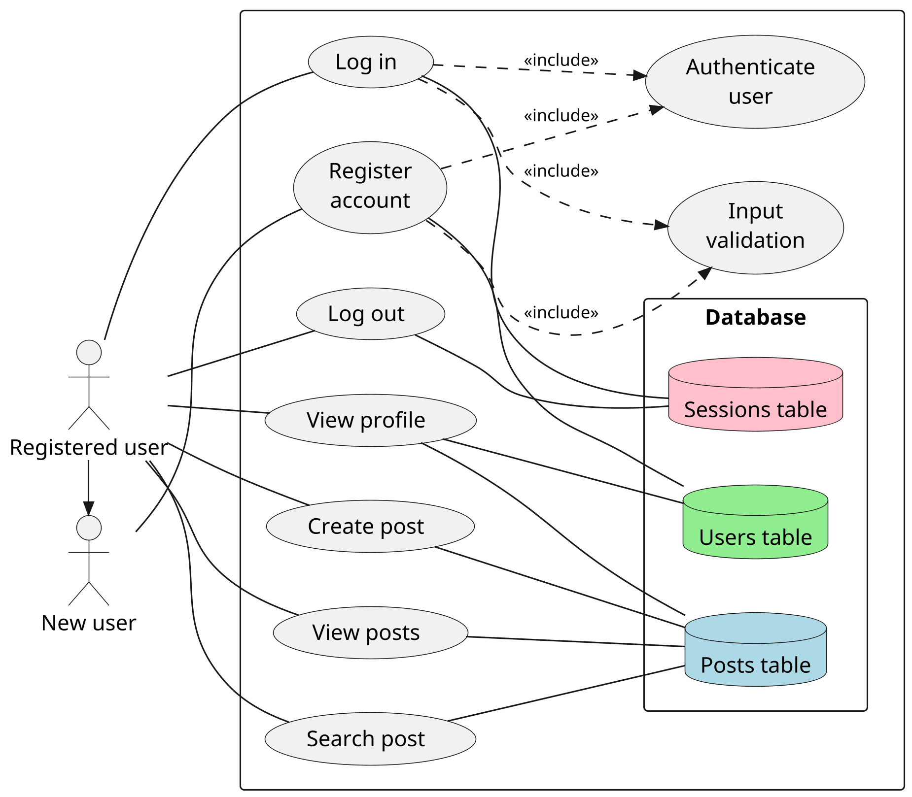

# Analysis of the problem

## Description of the problem

Project idea: A basic microblogging platform. The end users of the application will be other students in the Computing Science class or club, to allow them to share thoughts and ideas, and post updates to projects they're working on.

The platform will be a website with a frontend written in HTML and CSS for their compatibility with nearly all devices, and a backend written in Luau, as it's the language I'm most familiar with.

## UML use case diagram

