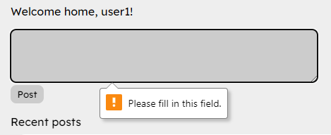
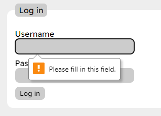
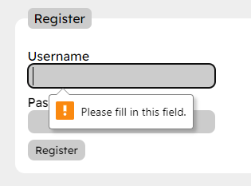
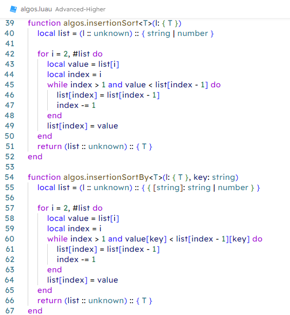
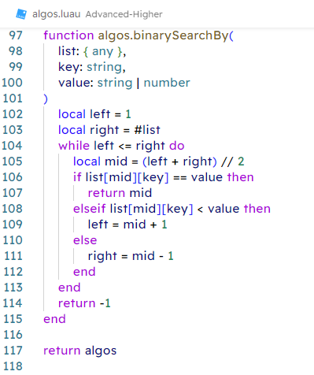
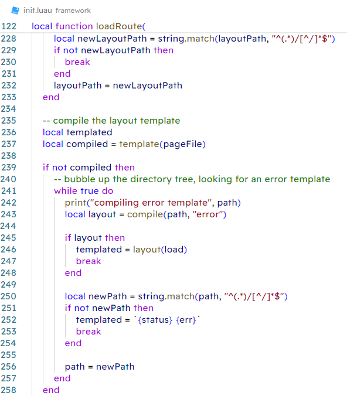

# Appendices

## Site screenshots

### Homepage
  
  
  

### Login

  
  
  
  

### Profile

  

### Register

  
  
  
  

### Search

  
  

## Code screenshots

### init.luau

### algos.luau

### auth.luau

### db.luau

### test.luau

### utils.luau

### framework/init.luau

### framework/compile.luau

### framework/component.luau

### framework/error.luau

### framework/redirect.luau

### framework/template.luau

### public/global.css

### components/Post.ltmp

### routes/layout.ltmp

### routes/layout.luau

### routes/page.ltmp

### routes/page.luau

### routes/(logged in)/layout.luau

### routes/(logged in)/profile/page.ltmp

### routes/(logged in)/profile/page.luau

### routes/(logged in)/search/page.ltmp

### routes/(logged in)/search/page.luau

### routes/(logged out)/layout.luau

### routes/(logged out)/login/page.ltmp

### routes/(logged out)/login/page.luau

### routes/(logged out)/register/page.ltmp

### routes/(logged out)/register/page.luau

### routes/logout/page.ltmp

