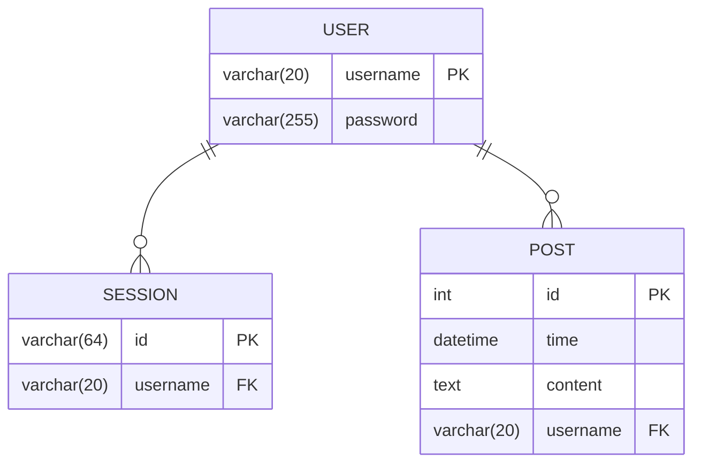
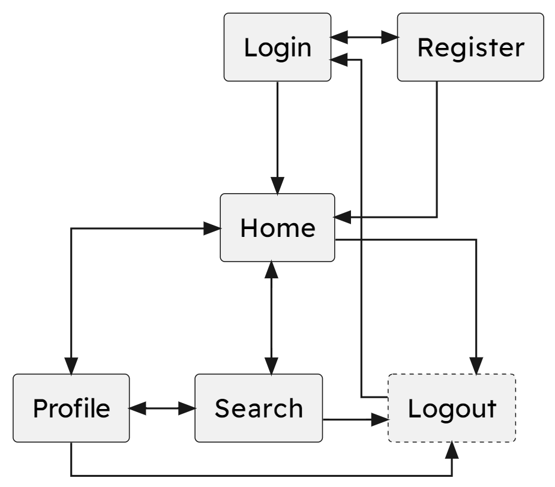
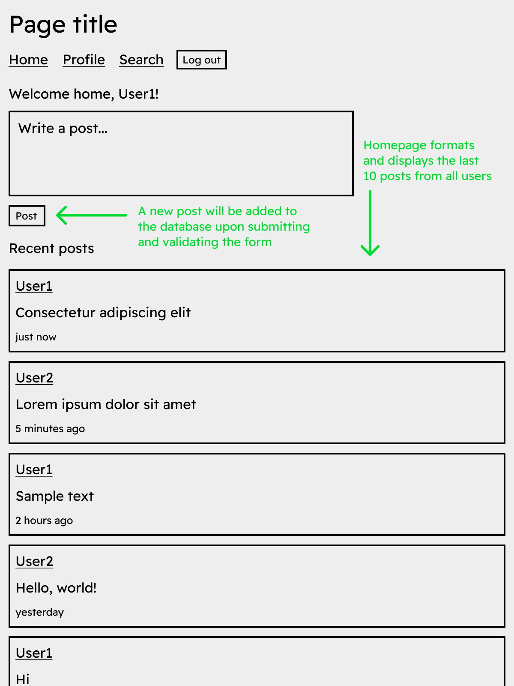
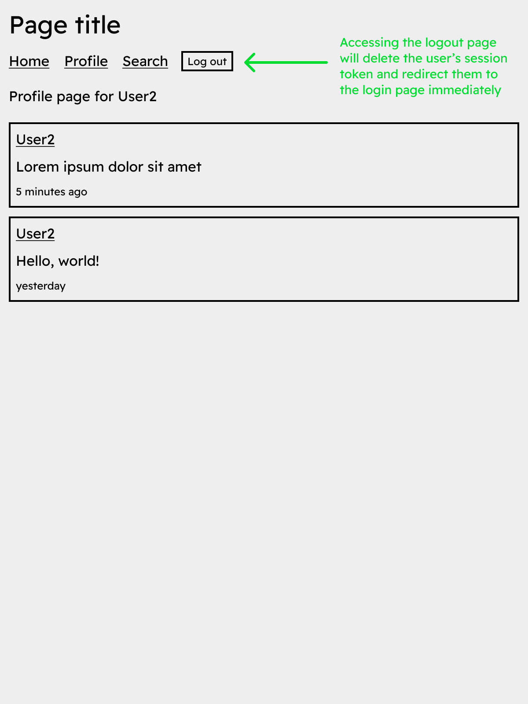
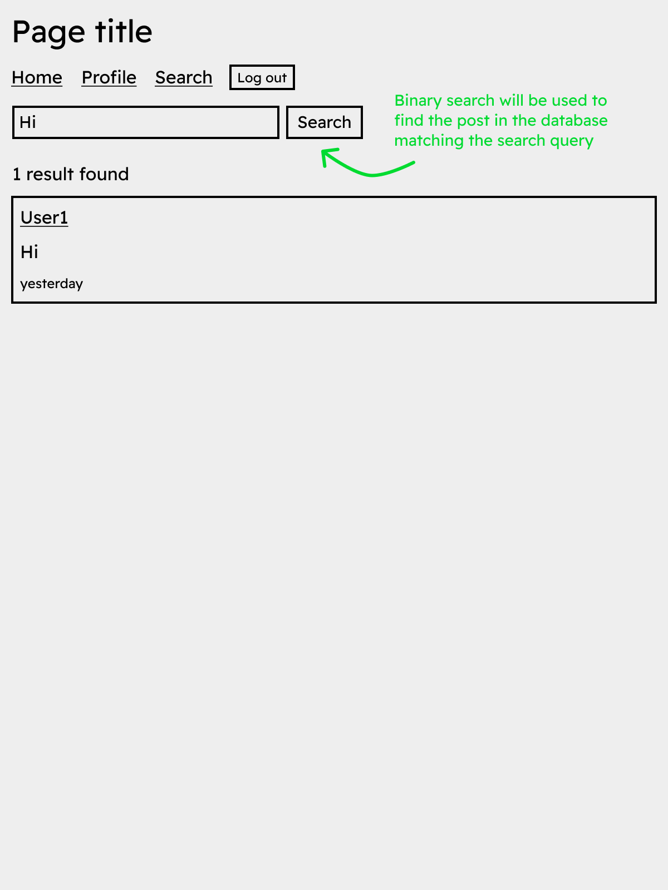
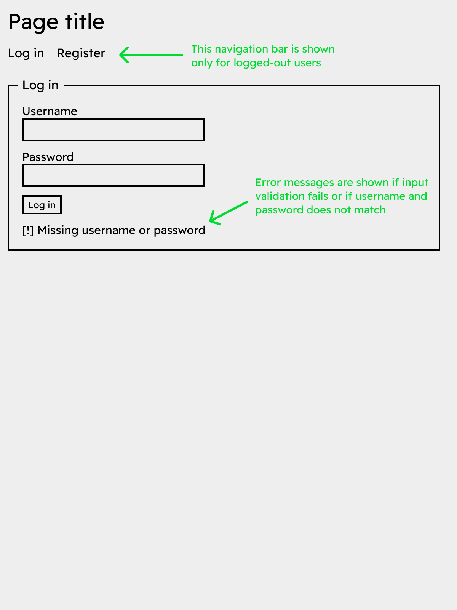
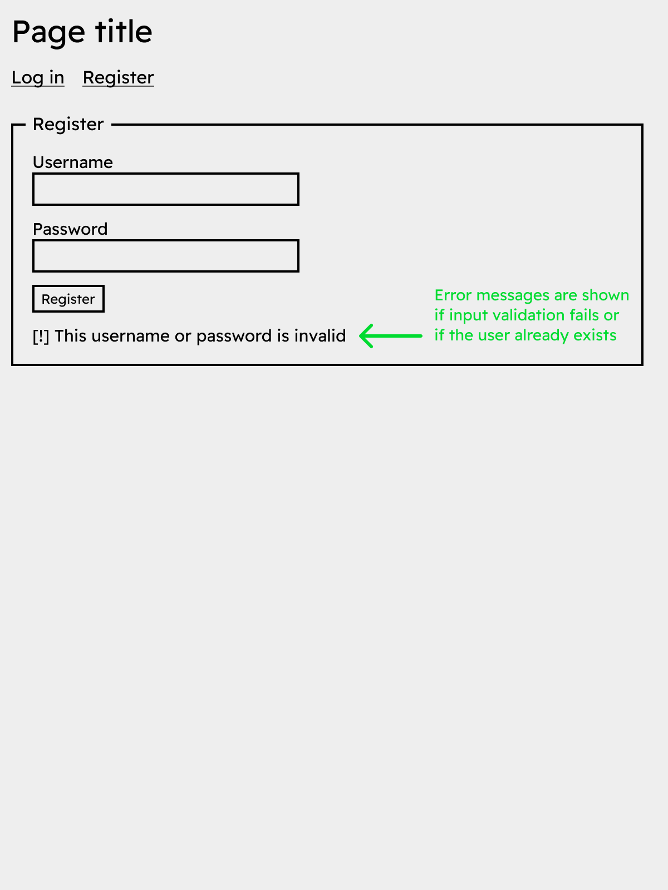

# Design of the solution

## Design of Advanced Higher concepts

Note that all array indices are 1-based in Luau, so the algorithms are designed with this in mind.

### Bubble sort

```
Set list to the input list
Set swapped to true
Set n to the length of the list
While swapped is true:
	Set swapped to false
	For i from 1 to n - 1:
		If list[i] is greater than list[i + 1]:
			Swap list[i] and list[i + 1]
			Set swapped to true
	Subtract 1 from n
Return list
```

### Insertion sort

```
Set list to the input list
For i from 2 to the length of the list:
	Set value to list[i]
	Set index to i
	While index is greater than 1 and value is less than list[index - 1]:
		Set list[index] to list[index - 1]
		Subtract 1 from index
	Set list[index] to value
Return list
```

### Binary search

```
Set list to the input list
Set value to the input value to find
Set left to 1
Set right to the length of the list
While left is less than or equal to right:
	Set mid to the floor of (left + right) / 2
	If list[mid] is equal to value:
		Return mid
	Else if list[mid] is less than value:
		Set left to mid + 1
	Else:
		Set right to mid - 1
Return -1, signifying that the value was not found
```

## Design of integration

### Query design

#### Registration query

Insert: username, password  
Table: users  
Values: validated inputs from registration form

Insert: id, username  
Table: sessions  
Values: generated session token, validated input username

#### Login query

Select: Just check if the user exists (select 1)  
Table: users  
Where: username matches the validated input username and password matches the validated input password

#### Logout query

Delete: sessions  
Where: id matches the session token in the cookie

#### Authentication query

Select: Just check if the session exists (select 1)  
Table: sessions  
Where: id matches the session token in the cookie

#### Homepage query

Select: post id, post time, post content, user username  
Table: post  
Join: user on post username = user username  

#### Create post query

Insert: post content, user username  
Table: post  
Join: session where user username = session username  
Values: input from post form, username matched from session token in the cookie

#### Profile query

Select: post id, post time, post content, user username  
Table: post  
Join: user where post username = user username  
Where: user username matches the username provided in the URL  

#### Search query

Select: post id, post time, post content, user username  
Table: post  
Join: user where post username = user username

Result of all posts will be searched with binary search

### Database design

All fields are required and not null on all tables

#### User table

Username: varchar(255) (primary key)  
Password: varchar(255)

#### Session table

Id: varchar(255) (primary key)  
Username: varchar(255) (foreign key referencing user username)

#### Post table

Id: int (primary key, auto-increment)  
Time: datetime (default to current time)  
Content: text  
Username: varchar(255) (foreign key referencing user username)

#### Entity-relationship diagram



### Design of website hierarchy



Accessing the logout page will immediately delete the user's session and redirect them to the login page.

### Server-side processes

#### Database connection

```
Proxy server:
	Connect to database using connection variables
	Start a server to listen for incoming requests
	When a request is received:
		Run the body as a query on the database
		If query or connection fails:
			Return an error message
		Return the result of the query

Website:
	Connect to proxy server
	If connection fails:
		Return an error message
	When the "query" function is called:
		Send the request to the proxy server
		If the request errors:
			Return an error message
		Return the rows of the result
```

#### User login

```
Get the submitted username and password
If either is empty:
	Return an error message
Query to find the user with the given username and password
If the user does not exist:
	Return an error message
Generate a new session token
Create a new session with the user's username and the session token
Return a redirect to the homepage with a "set-cookie" header containing the session token
```

#### User registration

```
Get the submitted username and password
If either is empty:
	Return an error message
Query to find the user with the given username
If the user already exists:
	Return an error message
Generate a new session token
Query to create a new user with the given username and password
Query to create a new session with the user's username and the session token
Return a redirect to the homepage with a "set-cookie" header containing the session token
```

#### User logout

```
Get the cookie from the request
Get the session token from the cookie
If the session token exists:
	Query to delete the session with the given session token
Return a redirect to the login page
```

#### Authentication

```
Get the cookie from the request
Get the session token from the cookie
If the session token exists:
	Query to find the session with the given session token
If the session exists and the user is trying to access the register or login page:
	Redirect the user to the homepage
Else if the session does not exist and the user is trying to access a page that requires authentication:
	Redirect the user to the login page
Else
	Display the requested page
```

#### Post creation

```
Authenticate the user
Get the body from the request
Parse the request body to find the post content
If the post content is empty:
	Return an error message
```

## User-interface design

### Homepage



### Profile



### Search



### Login



### Register


