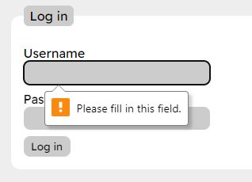
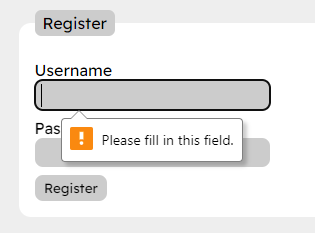

# Testing the solution

Both a test table and unit tests were created to ensure the solution was working as intended. Unit tests for Advanced Higher algorithms were stored in the `test.luau` file, and the corresponding test table is displayed below. All tests were repeated using normal, extreme, and exceptional test data where applicable to ensure the system was robust and could handle a variety of inputs.

## Advanced Higher algorithms

### Testing bubble sort

Type: Normal  
Test data: { 4, 6, 3, 8, 2, 7, 5, 9, 1 }  
Expected result: { 1, 2, 3, 4, 5, 6, 7, 8, 9 }  
Actual result: { 1, 2, 3, 4, 5, 6, 7, 8, 9 }  
Outcome: Pass

Type: Extreme  
Test data: { 1, 2, 3, 4, 5, 6, 7, 8, 9 }  
Expected result: { 1, 2, 3, 4, 5, 6, 7, 8, 9 }  
Actual result: { 1, 2, 3, 4, 5, 6, 7, 8, 9 }  
Outcome: Pass

Type: Extreme  
Test data: { }  
Expected result: { }  
Actual result: { }  
Outcome: Pass

Type: Exceptional  
Test data: { "string", 6, 3, 8, 2, 7, 5, 9, 1 }  
Expected result: attempt to compare string < number (error message)  
Actual result: attempt to compare string < number  
Outcome: Pass

### Testing insertion sort

Type: Normal  
Test data: { 3, 6, 5, 7, 4, 9, 2, 1, 8 }  
Expected result: { 1, 2, 3, 4, 5, 6, 7, 8, 9 }  
Actual result: { 1, 2, 3, 4, 5, 6, 7, 8, 9 }  
Outcome: Pass

Type: Extreme  
Test data: { 1, 2, 3, 4, 5, 6, 7, 8, 9 }  
Expected result: { 1, 2, 3, 4, 5, 6, 7, 8, 9 }  
Actual result: { 1, 2, 3, 4, 5, 6, 7, 8, 9 }  
Outcome: Pass

Type: Extreme  
Test data: { }  
Expected result: { }  
Actual result: { }  
Outcome: Pass

Type: Exceptional  
Test data: { "string", 6, 3, 8, 2, 7, 5, 9, 1 }  
Expected result: attempt to compare string < number (error message)  
Actual result: attempt to compare string < number  
Outcome: Pass

### Testing binary search

Type: Normal  
Test data: { 7, 4, 6, 8, 1, 3, 5, 2, 9 }, 5  
Expected result: 7  
Actual result: 7  
Outcome: Pass

Type: Extreme
Test data: { 5, 5, 5, 5, 5, 5, 5, 5, 5 }, 5
Expected result: 1 (the first occurrence of the value)
Actual result: 5
Outcome: Fail

Type: Extreme
Test data: { }, 1
Expected result: -1
Actual result: -1
Outcome: Pass

Type: Exceptional
Test data: { 2, 7, 3, 5, 9, 1, 6, 8, 4 }, 69
Expected result: -1 (value not found)
Actual result: -1
Outcome: Pass

## Testing site functionality

### Testing user registration

Type: Normal  
Test data:  
 Username: username (8 characters)  
 Password: password  
Expected result: Account creation, redirect to the homepage  
Actual result: Account creation, redirect to the homepage  
Outcome: Pass

Type: Extreme  
Test data:  
 Username: usr (3 characters)  
 Password: password  
Expected result: Account creation, redirect to the homepage  
Actual result: Account creation, redirect to the homepage  
Outcome: Pass

Type: Extreme  
Test data:  
 Username: twentycharacterslong (20 characters)  
 Password: password  
Expected result: Account creation, redirect to the homepage  
Actual result: Account creation, redirect to the homepage  
Outcome: Pass

Type: Exceptional  
Test data:  
 Username: thisusernameistoolong (21 characters)  
 Password: password  
Expected result: Error message displayed, "Your username must be between 3 and 20 characters long."  
Actual result: Error message displayed, "Your username must be between 3 and 20 characters long."  
Outcome: Pass

Type: Exceptional  
Test data:  
 Username: a (1 character)  
 Password: password  
Expected result: Error message displayed, "Your username must be between 3 and 20 characters long."  
Actual result: Error message displayed, "Your username must be between 3 and 20 characters long."  
Outcome: Pass

### Testing user login

Type: Normal
Test data:
Username: username (existing user)
Password: password
Expected result: Redirect to the homepage
Actual result: Redirect to the homepage
Outcome: Pass

Type: Exceptional  
Test data:  
 Username: username2 (non-existent user)  
 Password: password  
Expected result: Error message displayed, "Incorrect username or password."  
Actual result: Error message displayed, "Incorrect username or password."  
Outcome: Pass

### Testing post creation

Type: Normal  
Test data: This is a test post.  
Expected result: Post creation, page reload, and post displayed on the homepage  
Actual result: Post creation, page reload, and post displayed on the homepage  
Outcome: Pass

Type: Exceptional  
Test data: (empty post)  
Expected result: Error message displayed, "The content of the post cannot be empty."  
Actual result: Error message displayed, "The content of the post cannot be empty."  
Outcome: Pass

### Testing post search

Type: Normal  
Test data: This is a test post.  
Expected result: Post displayed in search results  
Actual result: Post displayed in search results  
Outcome: Pass

Type: Exceptional  
Test data: (empty search query)  
Expected result: Error message displayed, "Enter a search query"  
Actual result: Error message displayed, "Enter a search query"  
Outcome: Pass

### Testing user logout

Type: Normal  
Test data: Cookie exists in the database; user is logged in  
Expected result: Cookie deleted, redirect to the login page  
Actual result: Cookie deleted, redirect to the login page  
Outcome: Pass

Type: Normal  
Test data: Cookie does not exist in the database; user is already logged out  
Expected result: Redirect to the login page  
Actual result: Redirect to the login page  
Outcome: Pass

## Results

Most tests passed successfully, with only one failure in the binary search algorithm. This was due to the algorithm searching from the middle of the list, rather than the start, causing it to return a different index of the value than the expected first if there were duplicate entries in the list. This was solved by checking for duplicates in the list beforehand, then returning -1 if any duplicates were found. However, this is not a perfect solution as it compromises the efficiency and accuracy of the algorithm, though ended up being sufficient for the purposes of the project.

Furthermore, although the tests for input validation were all successful, the system was modified to also support client-side validation in HTML forms to provide a better user experience. Identical tests were run on the client-side validation, and all passed successfully.

Usability testing on the site also proved successful, with all features working as expected and providing a ease of use and a good user experience, meeting all end-user requirements. Multiple popular web browsers were tested for compatibility with the site, all of which were able to display it correctly and allow users to interact with it as intended.
